# FastAPI Full-stack

This is <b>my first FastAPI Full-stack project - todo application</b>.  
The application uses <b>FastAPI</b> with the <b>PostgreSQL</b> database as backend.   The application uses <b>JWT authentication</b>.  <b>HTML, CSS, SASS, Bootsrap, Jinja2 Templates</b> were used as the frontend. The user can log in, register, change the password, add new todos, edit and delete todos.    
In addition, the whole thing was containerized using <b> Docker</b> and <b>Docker Compose</b>   

## How to run it:
To run the application, you must have the <b>Docker</b> installed and turned on. Then download this project. You can delete the Illustrations folder, it was only used on gitchub for presentation purposes and it is not needed for the program to run. Then open the folder in the command prompt and enter the command: 
<b>docker compose build<b>   
and after it finishes downloading: 
<b>docker compose up</b>  
To open the application, open the browser and enter the address:  
<b>127.0.0.1:8000</b>   
Additionally, you can manage the database using pgAdmin 4, for this you need to open the browser with the address:  
<b>127.0.0.1:5050</b>   
Default login credentials are set in the .env file:  
login: admin@admin.com 
password: admin  

## Table of contents:
* [Technologies](#technologies)
* [Illustrations](#illustrations)

## Technologies
Project is created with:
* Python
* FastAPI
* PostgreSQL
* pgAdmin 4
* JWT authentication
* Alembic
* SQLAlchemy
* Psycopg2
* HTML
* CSS
* SCSS
* Bootstrap

## Illustrations

 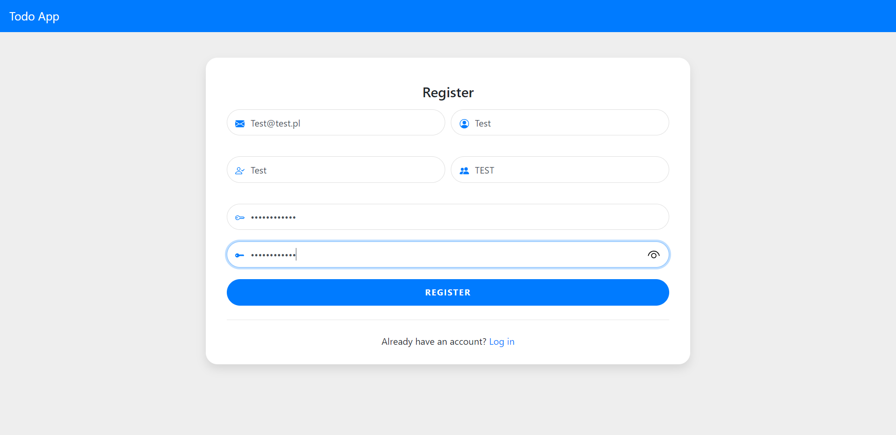
 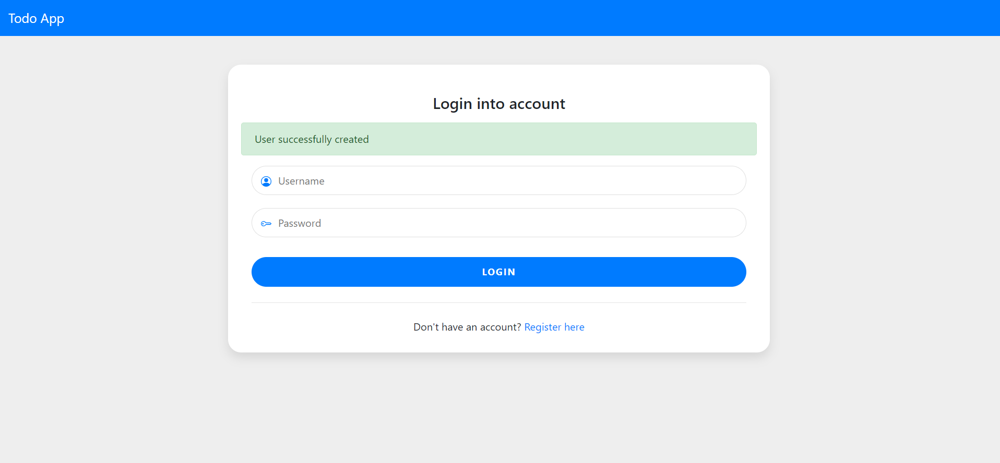
 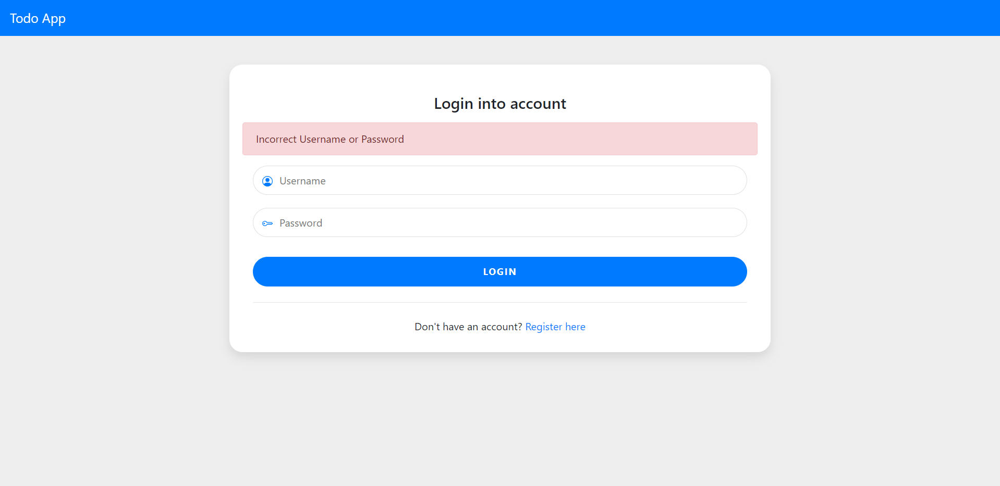
 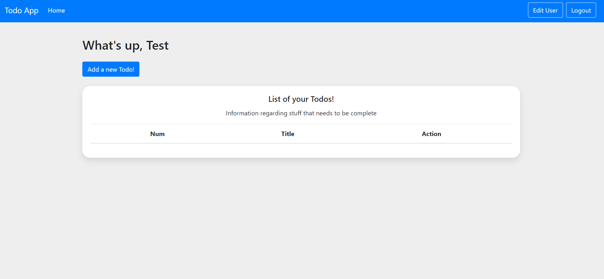
 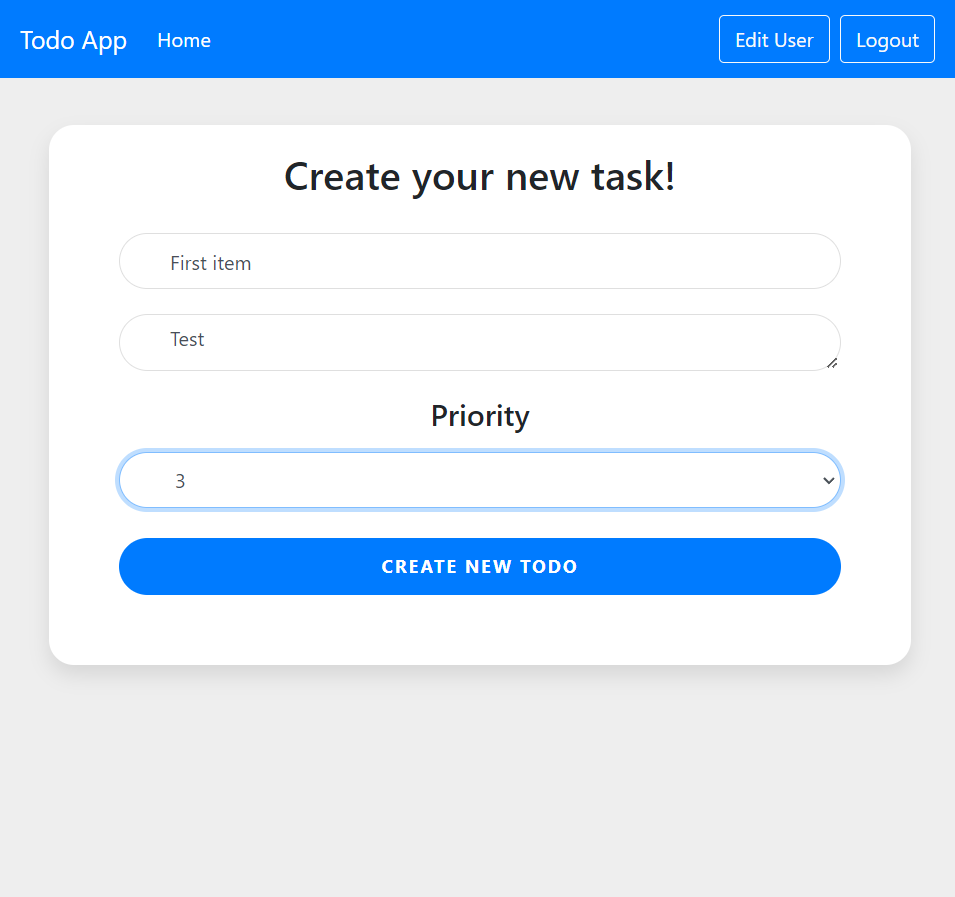
 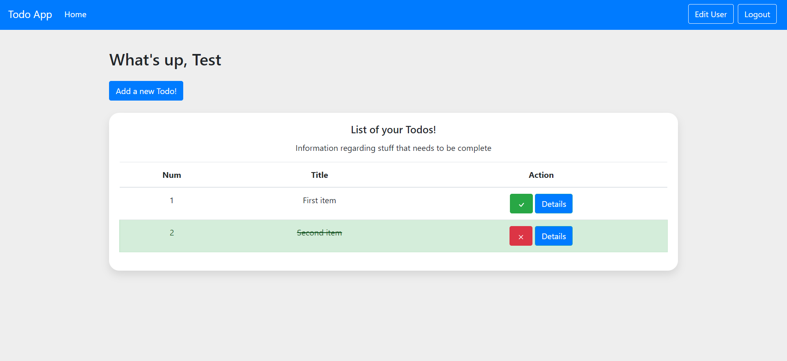
 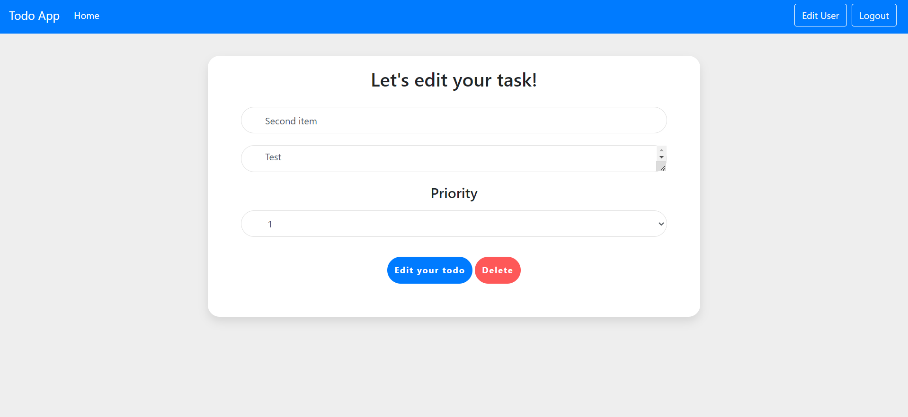
 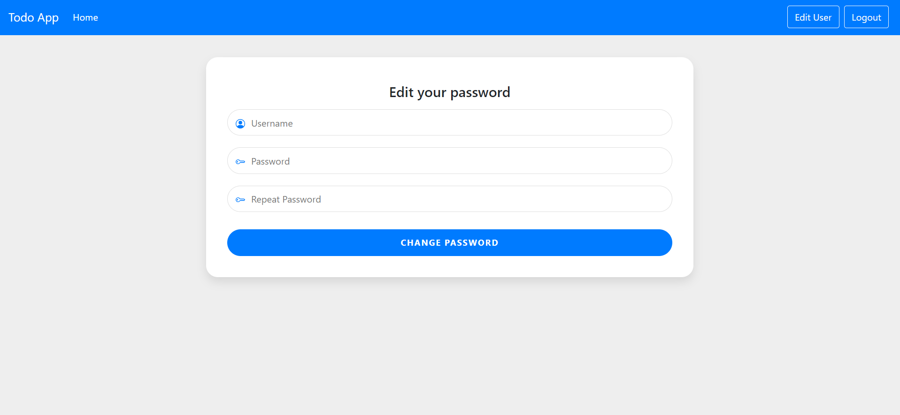
 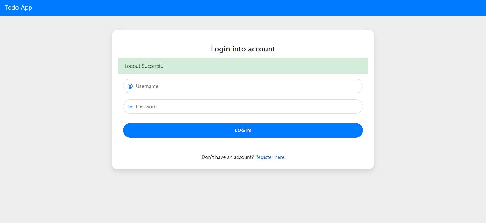
 
 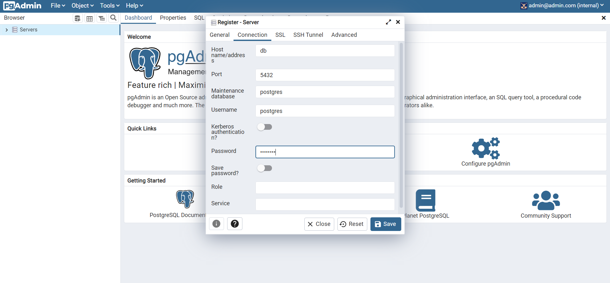
 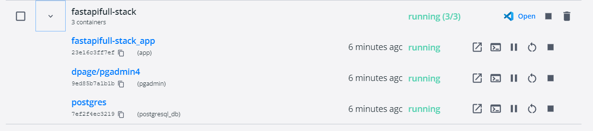

